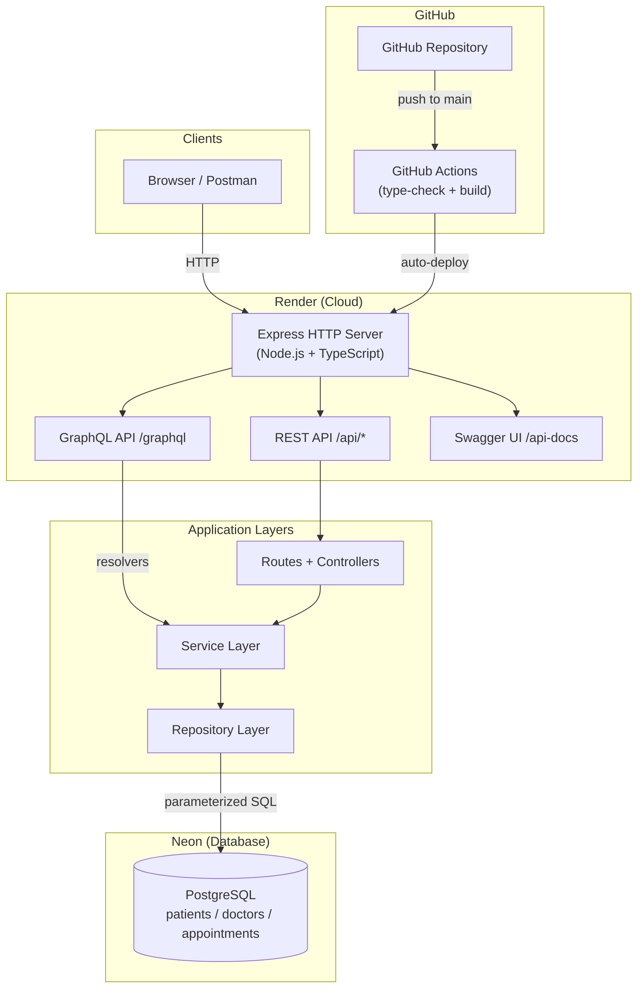

# System Architecture

The Hospital Appointment System is a Node.js API deployed on Render, backed by PostgreSQL on Neon. It exposes a REST API (Swagger) and a GraphQL API (Apollo Server) from a single Express HTTP server. Both interfaces share the same service and repository layers.

---

## Architecture Diagram

---

## Technology Stack

| Technology | Choice | Reason |
|------------|--------|--------|
| Language | TypeScript | Type safety, compile-time error checking |
| Framework | Express 5 | Minimal, widely used |
| Database | PostgreSQL (Neon) | Relational model fits appointment data |
| GraphQL | Apollo Server 5 | Industry standard, built-in Sandbox |
| Validation | Zod | Schema-first with TypeScript inference |
| Deployment | Render | GitHub integration, free tier |
