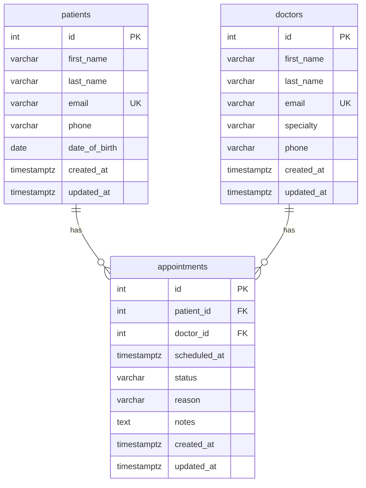

# Database Schema

Three PostgreSQL tables hosted on [Neon](https://neon.tech), following third normal form (3NF).

---

## Entity Relationship Diagram

---

## Table Definitions

### `patients`

| Column | Type | Constraints |
|--------|------|-------------|
| `id` | SERIAL | PRIMARY KEY |
| `first_name` | VARCHAR(100) | NOT NULL |
| `last_name` | VARCHAR(100) | NOT NULL |
| `email` | VARCHAR(255) | UNIQUE NOT NULL |
| `phone` | VARCHAR(20) | optional |
| `date_of_birth` | DATE | optional |
| `created_at` | TIMESTAMPTZ | DEFAULT NOW() |
| `updated_at` | TIMESTAMPTZ | DEFAULT NOW() |

### `doctors`

| Column | Type | Constraints |
|--------|------|-------------|
| `id` | SERIAL | PRIMARY KEY |
| `first_name` | VARCHAR(100) | NOT NULL |
| `last_name` | VARCHAR(100) | NOT NULL |
| `email` | VARCHAR(255) | UNIQUE NOT NULL |
| `specialty` | VARCHAR(100) | NOT NULL |
| `phone` | VARCHAR(20) | optional |
| `created_at` | TIMESTAMPTZ | DEFAULT NOW() |
| `updated_at` | TIMESTAMPTZ | DEFAULT NOW() |

### `appointments`

| Column | Type | Constraints |
|--------|------|-------------|
| `id` | SERIAL | PRIMARY KEY |
| `patient_id` | INTEGER | FK → patients(id) ON DELETE CASCADE |
| `doctor_id` | INTEGER | FK → doctors(id) ON DELETE CASCADE |
| `scheduled_at` | TIMESTAMPTZ | NOT NULL |
| `status` | VARCHAR(20) | CHECK IN ('scheduled','completed','cancelled') DEFAULT 'scheduled' |
| `reason` | VARCHAR(500) | optional |
| `notes` | TEXT | optional |
| `created_at` | TIMESTAMPTZ | DEFAULT NOW() |
| `updated_at` | TIMESTAMPTZ | DEFAULT NOW() |
